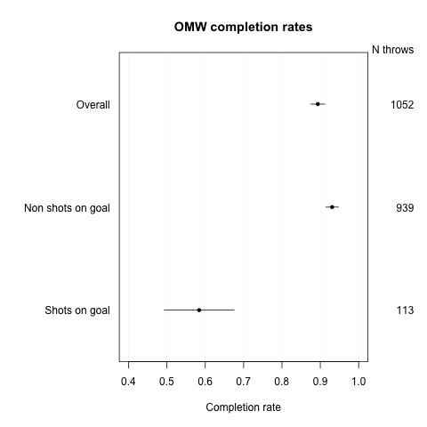
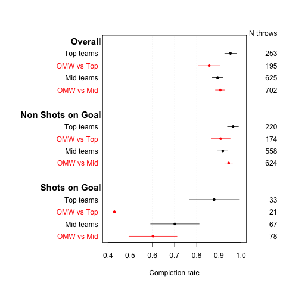
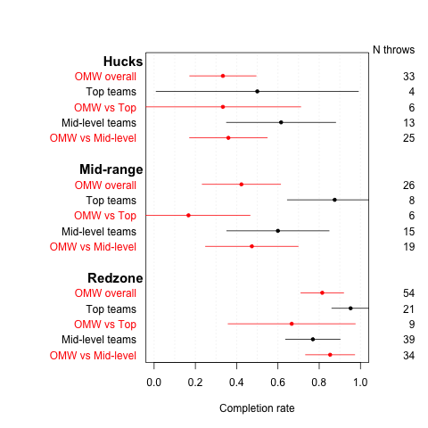
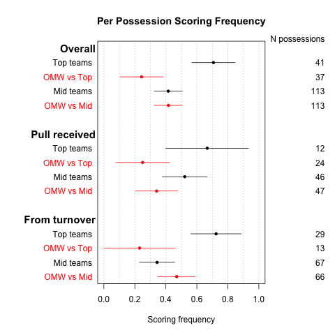
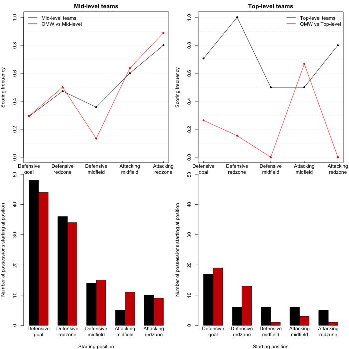

# Introduction

I'll take a look at the performance of Old Man Winter at Nationals 2017 to see where we did well, and what we should improve on to step up to the next level. Because the recorded stats are primarily offense oriented, I will be doing this by gauging how well we did on offense in comparison to our opponents. I will be looking at two basic measures:

-   **Completion rate:** The fraction of throws that are caught. This could be broken down into throws that meet certain criteria.
-   **Conversion rate:** The fraction of **possessions** that result in a goal (versus being turned over). Again, possessions can be broken down into certain types (e.g. received the pull or not).

The data for this analysis can be found in [this](https://github.com/mabney/old-man-winter/blob/master/Analysis2017/nationals_2017_data.csv) csv file.

# Completion rates

## Old Man Winter

We can look at our completion rates across all games at Nationals 2017, as a general baseline. We also break this down into two categories, throws that are shots on goal (SG) and throws that are not shots on goal (NSG). A shot on goal is a throw that was either caught in the endzone for a goal or if it had been caught, would have been a goal.

### Takeaway

Our overall pass completion rate was `0.89`, which is not very good. Worse, however, is our rate of completions when we are actually trying to score, `0.58`, which is terrible.

## Other teams

Let's compare our completion rates against the completion rates of our opponents. Here, I group the opponents into 'Top' teams, Surly and Johnny Walker; and 'Mid' teams, all our other opponents except Critical Mass.

### Takeaways

Some important points to be learned from the above plot:

1.  Top teams, against us, complete about 95% of their passes, while mid-level team complete about 90% of passes.
2.  Shots on goal are harder to complete; the field is more compressed overall. Top teams still complete about 90% of passes, while mid-level teams are at 70% or lower.
3.  Even for a mid-level team our shots on goal completion rate is bad and absolutely atrocious against top level teams.
4.  The strong defense of top teams makes a huge difference. This is evident from our substantially lower completion rate against top teams across all categories compared to our completion rate against mid-level teams.

## Shots on goal by distance

Our data includes the field location from where a shot on goal was thrown. Hucks are from our own half of the field, mid-range is from the brick mark to midfield, and the redzone is from the goal line to the brick mark. Completion rates grouped by the location of the thrower and the team's level:

### Takeaways

The 95% confidence intervals are wide because of some low numbers of throws, but the lessons here are:

1.  Compared to the other teams, our hucks sucked, but we knew that.
2.  Compared to the other teams, our mid-range shots on goal also sucked. I'm not sure we knew that.
3.  In the redzone our shot on goal completion rate was somewhat better than the other mid-level teams, but at about 85% is still low compared to what we want.
4.  The top level teams had about 2/3 of their shots on goal from within the redzone and mid-level teams were close to that. We only had about 50% of our shots on goal from within the redzone.
5.  Top and mid-level teams both had similar numbers of shots from mid-range and from hucks, with a bias to more mid-range shots. We actually had more hucks than mid-range shots. Our completion rate for both of those, though, was so bad that maybe it does not matter.

# Conversion rates

What was our probability of scoring given that we:

1.  Gained possession of the disc (either from a pull or opponent's turnover)?
2.  Received the pull?
3.  Gained possession after an opponent's turnover?
4.  Got possession a certain distance from the goal line?

How did these probabilities compare to our opponents, stratified by their quality?

## Conversion rates from pulls and turnovers

### Takeaways

What the above plot tells us:

1.  The top teams score about 70% of the time when they get possession of the disc. This is consistent whether they got the disc from a pull or from an opponent's turnover.
2.  The mid-level teams tended to have a higher chance of scoring, about 50% of the time, when they received the pull compared to when they got the disc from our turnover.
3.  In contrast, when we received the pull against a mid-level team, we scored only about 34% of the time without turning it over. (O-line what's up?!) We need to double that rate to step up to the next level.

## Conversion rates based on starting field position

In the left column are the statistics from games against the mid-level teams, while on the right are the games against the top teams. The top row shows how often we (in red) or our opponents (in black) score without turning it over when gaining possession a specified distance from the endzone. The start positions on the left sides of the plots are more distant from the scoring endzone. The bottom bar charts are the number of times the teams gained possession in each field area.

### Takeaways

1.  We have very similar conversion rate to other mid-level teams, given a starting field position, though very low when starting in our defensive half of the field between the brick mark and midfield line.
2.  The good news was that when we gained possession in the attacking redzone we converted 90% of the time.
3.  The bad news is that we convert only 30% of the time when we get the disc in our own endzone.
4.  The top teams turned the disc over in their half of the field, giving us a short field, very rarely (86% of the time we started our possession in either our own redzone or goal). On the other hand, about 28% of the time they were able to give themselves a short field by causing a turnover in the half of the field they were attacking.
5.  Giving ourselves a short field is a huge gain in conversion rates. Against mid-level teams we did this 18% of the time. Our defense should aim to push that up to 25% or higher.
6.  Against other mid-level teams we won the field position battle, though not by a lot, giving up a short field 13% of the time but getting a short field 18% of the time.

# Final conclusions

1.  Our shots on goal completion rate seriously stank, though they stank relatively less when we were in the redzone. The spin doctor says we have a great opportunity to make large strides simply by improving our shots on goal.
2.  We need to improve our huck game, but not because we want to score (or try to score) from the huck more often. This needs to be more of a strategy that allows us to advance the disc to the redzone where we have much higher success.
3.  Converting when we receive the pull, without turning it over, is a huge weakness, even compared to other mid-level teams (35% vs 52%).
4.  Giving ourselves a short field by forcing the other team to turn it over in their half of the field can bring huge dividends (90% conversion vs 30% conversion). Similarly, not turning it over in our half of the field is tremendously beneficial.